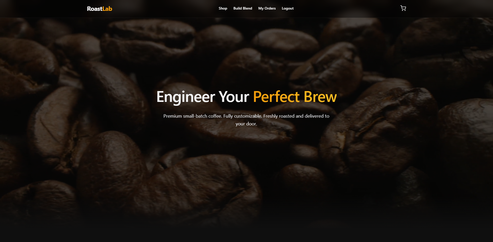
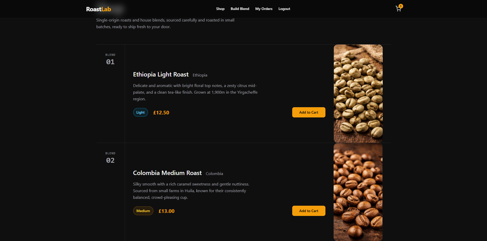
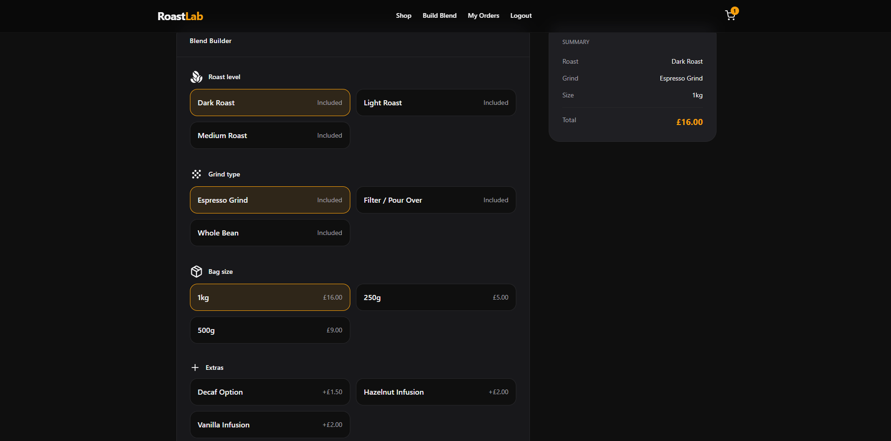
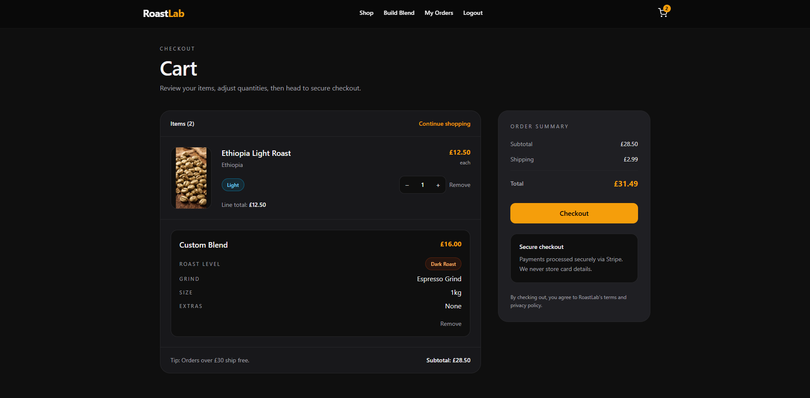
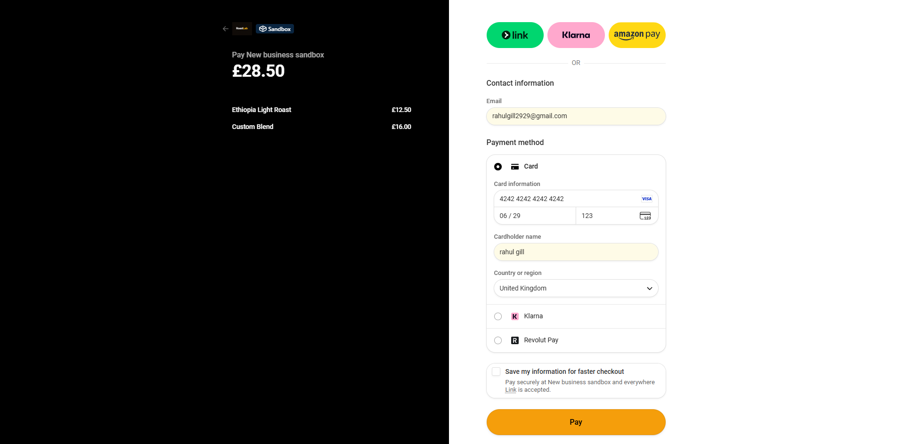
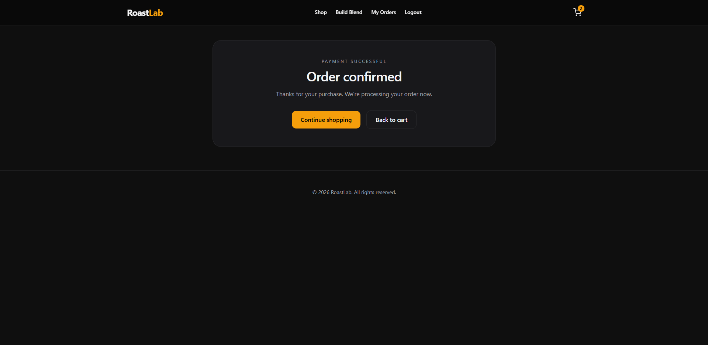
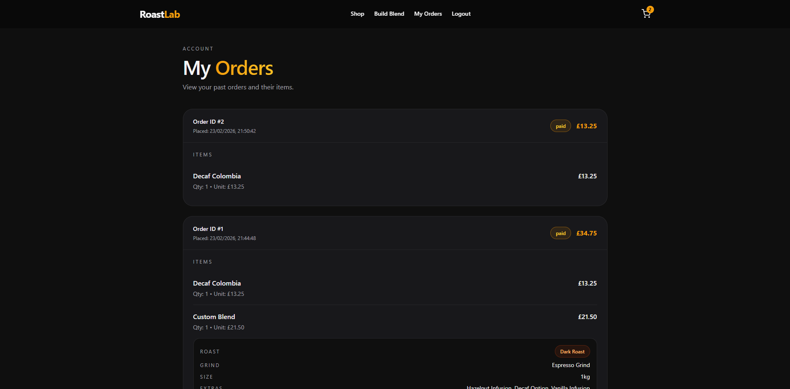

# ☕ RoastLab

RoastLab is a full-stack coffee e-commerce platform where users can purchase premium beans or build fully custom blends with dynamic pricing.

It demonstrates a modern **React + Laravel architecture**, secure **Stripe payments**, and a hybrid cart system that mirrors real-world e-commerce patterns.

---

## 🌍 Live Deployment

🔗 https://roast-lab-theta.vercel.app/

---

## 🚀 Deployment Stack

- **Frontend:** Vercel (React application)
- **Backend:** Render (Laravel API with Docker containerisation)
- **Database:** PostgreSQL (hosted on Supabase)

---

## 🎨 Design Approach

RoastLab uses a minimalist, product-focused design to keep the user experience clean and intuitive. The UI emphasises clear product presentation, smooth navigation, and responsive interactions, with subtle animations used to enhance rather than distract.

This approach was influenced by my experience designing frontend interfaces for an early-stage startup, where a minimalist design language was used to prioritise clarity and usability. While the company is no longer active, the design principles from that work informed the visual direction of RoastLab, particularly the focus on simplicity, spacing, and product-first layouts.

An archived version of that work can be viewed here: https://web.archive.org/web/20250107150352/https://cannasa.co.uk/

---

## ⚠️ Important Notes for Live Site

### ⏱️ Initial Load Time

The backend uses Render's free tier, which spins down after periods of inactivity.  
On your first visit (or after inactivity), the backend may take **30–60 seconds** to wake up. Subsequent requests will be much faster.

### 💳 Stripe Test Payments

The live deployment uses **Stripe test mode**.

To complete checkout during testing, use the following card details:

- **Card number:** 4242 4242 4242 4242
- **Expiry date:** Any future date
- **CVC:** Any 3 digits
- **Name:** Any name

After entering these details, you can complete checkout normally and the order will be created in the system.

## 🧠 Key Features

- 🛒 Product shop
- ☕ Custom blend builder
- 💰 Dynamic pricing engine
- 🧺 Persistent cart (localStorage)
- 💳 Secure Stripe checkout
- 📦 Order history
- 🔐 Token-based authentication
- 📱 Mobile-responsive UI
- 🎞 Animated homepage

---

## 🛒 Shopping & Order Flow

### 🛍 Browsing

- Users can view all coffee products without logging in
- Users can build a custom coffee blend without logging in
- Products and blend options are fetched from the API

---

### 🧺 Cart

Users can add:

- Standard products
- Custom blends

Cart behavior:

- Stored in **localStorage**
- No login required at this stage

---

### 💳 Checkout

At checkout:

- User **must log in or register**
- Cart is sent to backend for **price validation**
- Stripe Checkout session is created
- User pays securely via Stripe

---

### ✅ After Payment

- Order is created
- Order marked as **paid**
- Custom blends saved to database
- User can view orders in **My Orders**

---

## 📸 Screenshots

### 🏠 Homepage

### 🛒 Browse Products

### ☕ Custom Blend Builder

### 🧺 Cart

### 💳 Stripe Checkout

### ✅ Order Confirmation

### 📦 Order History

---

## 🛠 Tech Stack

### Frontend

- React (Vite)
- React Router
- TanStack Query
- Tailwind CSS
- GSAP
- Hosted on **Vercel**

---

### Backend

- Laravel API
- Sanctum token authentication
- Stripe integration
- Docker container
- Hosted on **Render**

---

### Database

- PostgreSQL
- Hosted on **Supabase**

---

## 🏗 Architecture & Design

RoastLab follows a decoupled frontend–backend architecture designed to mirror modern e-commerce systems.

The **React frontend** is responsible for product browsing, custom blend configuration, cart state management, and UI interactions. Cart data is stored client-side for responsiveness and is only sent to the backend during checkout.

The **Laravel API backend** handles product data, dynamic pricing validation, Stripe checkout session creation, order persistence, and authentication. All pricing is recalculated and verified server-side during checkout to prevent client-side manipulation.

Authentication is handled using Laravel Sanctum with token-based auth, ensuring that only authenticated users can complete checkout and access order history.

Stripe is used as the payment authority, with orders created only after successful payment confirmation.

---

## 💡 Why This Project?

RoastLab was built to demonstrate a full-stack e-commerce architecture with a realistic end-to-end purchasing flow. The project focuses on implementing dynamic pricing logic for custom products, secure Stripe payment integration, and authenticated order history, while also supporting a flexible custom blend builder that tries to mirrors real-world product customisation systems.

The application is designed around patterns I've seen in production e-commerce platforms. The cart is managed client-side for responsiveness, while all pricing is validated server-side to prevent manipulation. Stripe is used as the payment authority to ensure secure and compliant transactions, and orders are only created after successful payment confirmation.

---

## 🔮 Future Improvements

To make the website more production-ready, I would introduce an admin dashboard for managing products, orders, and users, along with inventory tracking and order status updates. In addition to displaying order history in the **My Orders** page, I would implement email receipts to support more customer-friendly post-payment workflows, as well as features such as discount codes to enhance promotional capabilities.

For the custom blend builder, future iterations would allow users to save favourite blends, quickly reorder previous blends, and preview their blend visually before checkout.

From a user experience perspective, I would refine the interface with a cart drawer, toast notifications, skeleton loading states, and improved browsing tools such as product filters, search, and pagination to better support larger product catalogues and improve overall usability.

---

## 🧾 License

This project is for portfolio and educational purposes.
